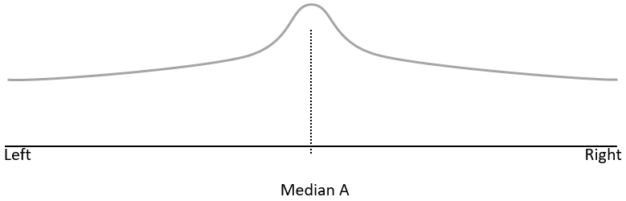
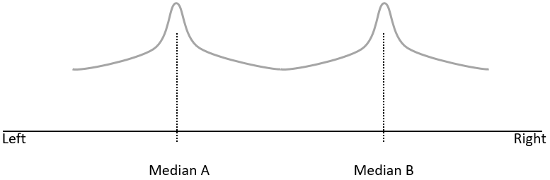
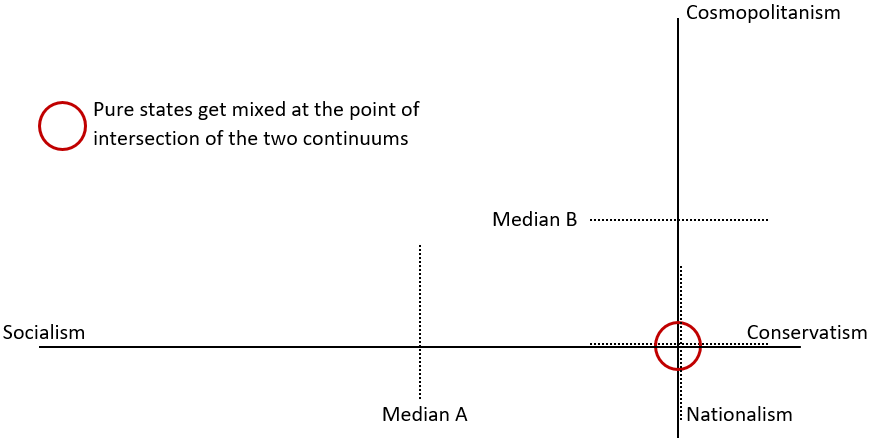
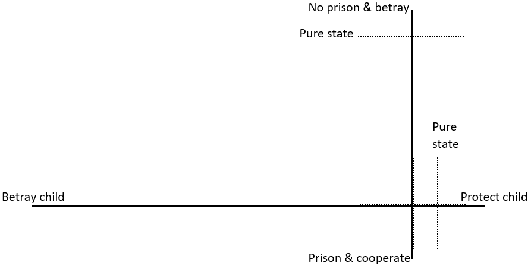
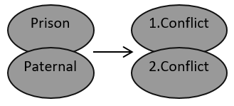
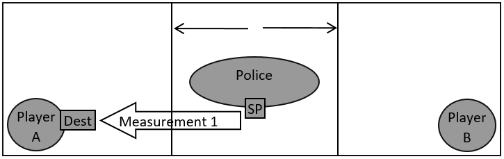
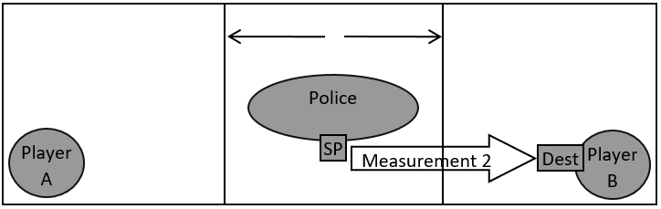

# The (mixed) state of games: how to use qualitative measures to transfer quantized games to real world applications

## 1. Observing the game
Classical game theory approaches build games around given conflicts. Therefore, a conflict equals the game. The game itself is part of the observing element (observer), made to analyze its content. The content includes the actors and their strategies. However, the game itself is not observed and its condition remains a supposed determination, assumed to be constant. Therefore, the observer cannot observe if its own condition changes and so the environment of its content: changed rules of the game remain hidden.

Generally, the game is the environment for its actors. An actor's condition (state) is affected by its environment and vice versa. As different games affect each other, their respective pure states can mix. Games can mix sequentially or in parallel: a game can affect succeeding games and simultaneous games. Transferring a basic concept from quantum field theory, (field) quantizing (Fock, 1932; Dirac, 1927) the game allows incorporating relationships between different games and between a single game and its actors into analysis, including their influences on each other.

## 2. Mixing static games
The Median voter theorem illustrates a static game with a pure state (Downs, 1957, p. 143). Players are mapped into a generic left-right continuum (Figure 1).

Figure 1: Median voter continuum with one median

Nevertheless, Downs (1957, p. 143) also describes a continuum with two medians (Figure 2). A second median indicates a mixed state of the game, with one of the medians being the point of intersection with a second game and its continuum: both games have their own respective median, and the common point of intersection (Figure 3). Nevertheless, like figure 1, figure 2 observes only one game and still, it does not equal the game of figure 1. Consequently, the game of figure 2 is affected by a mixed state even if only one continuum is observed. The mixed state changes the conditions of both games while changes in one game result in changes in the other, too.

Figure 2: Median voter continuum with two medians
  

Figure 3: Different median voter continuums of two games in a mixed state at the moment of observation. To illustrate, both continuums were not mapped to left and right.

Players expect opponents to act against the same state. If an opponent behaves differently, the player has to adapt to the unexpected course of play to solve that (cognitive) dissonance. Still, the analysis of players cannot observe dissonance as it arises in between different games, not in between different players: different players observe their respective mixture of games from different perspectives, gaining different results. When acting, players can choose between two types of strategies: they can aim to win the current game, and they can aim to determine which game is to be enforced. The latter indicates the existence of a meta game: a game between games, in which the latter are observed contents.

## 3. The prisoner dilemma: measuring the prisoners and their collective state
In static games, players exist only in the moment of observation. Referring to the prisoner dilemma, if player A is the father of player B, the paternal conflict influences the conflict about imprisonment.
On one hand, a father wants to protect his child. On the other hand, player A does not want to get imprisoned. Therefore, the game is in a mixed state from the perspective of player A (Figure 4). Player B can be in a comparable state. Still, if player B is playing a pure state game with his focus remaining on not getting imprisoned, there will be two different observations of a game from two different perspectives: one with a pure state, one with a mixed state. 

Figure 4: The mixed state of player A with the paternal game being dominant in the mixture.

However, if player A plays with the police and not with player B, while B remains playing with A, the goals of both are equal: avoid imprisonment of prisoner B. Still, player B observes a game between A and B. An an external “overall observer” with perfect information about both prisoner players and the police on the other hand, observes a game between A and the police, a game between B and A as well as a game between the police and B. The latter game is from the perspective of the police, which plays with B and wants B to play with A. Nevertheless, an observation from the police includes two games: the game with A, also played by A, and the game with B, who plays a different one with A.

The pure prisoner game and its players exist only when and whilst observed by player B, and only as long as player B assumes player A to play the same game (assuming both to betray), due to B’s imperfect information and the resulting uncertainty in B’s observation.

Consequently, exact players also exist only in the moment of observation. For example, A only observes the consolidated player (player A+player B) which plays with the police player, and is likely to ignore any betrayal of B even if known. Player B’s game includes other players. During the absence of an observation, players have no agency. Further, it implies that pure games contain two actors. Less players imply that there is no game while more than two players imply a mixed state of different games. Different perspectives observe different states from different games, and so different mixtures.

If the opponent’s behavior, based upon its observation, is not understood, (cognitive) dissonance is the result and remains until information that explains the behavior is achieved. If player B’s state assumes a traditional prisoner dilemma without a dominant paternal conflict, B gets affected by dissonance when observing player A’s behavior. Consequently, the next observation of player B gets affected as well.

Finally, the sum of all observations forms a (wave) function (Born, 1927), which incorporates perfect information of all observed games and their actors, representing their collective state. However, the function and its perfect information are available to no single observation from within a contained game. Every contained observation itself results in changes in the function while remaining unable to observe itself, and therefore the induced change of the function.

## 4. Dynamics of successive observations

Even in static games, there are dynamics between games that play in parallel if these games are not in a pure state. If sequences are added, further dynamics arise from different mixtures of games that are solved into, or succeeding each other. If player A is prosecuted for 10 years while player B is released, the paternal and the imprisonment games are solved. From player A’s perspective, their mixture is solved into new conflicts about how to manage the time in prison. The new conflicts get a mixture either, affected by the games played by other prisoners (Figure 5). Games after the time of imprisonment are then to be affected by the outcome of the games played while in prison. Still, the games remain successive but static observations: they succeed, and are solved into, each other. Each observation is a snapshot.

Figure 5: Two observations from player A of succeeding mixed states of games, assuming player A to get imprisoned after the first observation.

## 5. Quantizing (Darwin): how observations interact

There is a state if there is an observation and there is no state if there is no observation. It remains the question of where the agency lies. An observation does not incorporate time but information, and there cannot be agency without time: an observation is a function with input and output based upon given information. Therefore, agency and time can only rise in between observations, tied to the successive character. Therefore, natural selection can only apply to observations, affecting the observer (or the observer’s behavior), not the observed.

In the initial prisoner game, before the imprisonment of player A, there are three observations at different places at the same time: the interrogation room of player A, that of player B and police interrogators from an observation room with one-way mirrors to both interrogation rooms. If the dynamics of successive observations from different places at different times are added, the number of possible players and actions in these function’s games, and generally the number of available games contained in the function, increase exponentially: tied to the observer.

Complexity further increases when the memory of previous observations is added to current observations due to the changed distribution of contained information, accelerating the appearance of agency. Available selections, assumed outcomes and final decisions remain determined by the starting point of the observation and the information, which is available at this point.

So, from player B’s starting point, the observation assumes a game between two prisoner players to be dominant. This game and its actors are not dominant, or not even existing, if an observation is done in the room of player A. Still, the police have an observation room with information about both prisoner players, focusing the game of room/player B and neglecting A, playing a game of keeping the information from A invisible to B, making B playing the assumed game of the given room: the police play with B.

## 6. Uncertainty & collapses

Nevertheless, the uncertainty principle (Busch et al., 2007) indicates each observation of a player to manipulate behavior and vice versa. Therefore, each observation manipulates the (wave) function with its perfect information (figure 6 and 7): if player A observes and indicates to not cooperate with the police, the mixed state of the police changes due to the transferred information, too. Therefore, the police now focus on interrogating player B, who still assumes to play against the other player, changing the mixed state of player B. Still, the observed player A knows about the possibility of being observed and even if A cannot do much about it, A’s information changes as well.

Figure 6: A function incorporating perfect information, as it appears at observation 1. The information available to the observation depends on its starting point (SP) and is further limited by its destination (Dest).

Figure 7: A function incorporating perfect information, as it appears at observation 2. Observation 1 manipulated the distribution of information and therefore, manipulated the consequent function at observation 2: observation 1 transferred information from its destination to its starting point, changing the destination of the consequent observation.

But why does the state of the police change when player A and B are observed? The answer gives evidence for the development of quantized agency: The figures 6 and 7 contain the police as player within the given function. Therefore, the police are not the observer but are themselves being observed. Accordingly, the two succeeding observations of the police contain different states.

Both observations anticipated the state of the police correctly. If the police interrogator had left the room after the first observation while the observer had not anticipated that behavior, the second observation would no longer contain the interrogator: the appearance of the interrogator in the anticipated state verifies the anticipation. If the state would not had corresponded to the anticipation, the interrogator would had been disappeared in the second observation.

Therefore, the observation of the police player changed that player’s behavior as seen in the succeeding observation. Even if both figures contain each player who is not part of the observation, the information of each player is known to the observer, making them appear (and considered). The police’s observations are known to the observer and appear in the function as anticipated, giving evidence for that anticipation: the police’s observations are themselves information within the function, and a function with its perfect information can contain many games, which can mix.

Another important information is the number of players in the function as each game can only have two players. Player B appears in the first observation as its state is known but remains unchanged subsequently: B is not a player, it is just information in the function, not tied to internal observations that make players. In the first observation, there are finally two players: player A plays with the police and vice versa. The second observation focuses the police that plays with player B, including two players, too. However, a succeeding (third) observation would include player B observing, and so playing with, player A.

Nevertheless, player B cannot observe player A in the functions available to the “overall observer”. Therefore, player B can finally only observe and play with the police and if anticipated by the “overall observer”, B’s observation would be itself an information in the third observation’s function. Still, player B would assume to play with the consolidated (police+player A) and not simply the police. Therefore, from the “overall observer’s” perspective with perfect information about all three players and their succeeding games, player B’s observation from B’s perspective with B’s information focuses on a player that seems to not exist, given existence of (police+player A) only by B’s observation.

If the police anticipate this state of player B, the police can corrupt its output in B’s observation to correspond (police+player A) in order to make player B playing that game. It forms a merged player with player A without A’s intention, focusing on a state that both have effectively in common, implying (police+player A). For example, the state of knowing where the crime happened. If player B is enforced to make such an observation, the output of B’s observation would correspond (police+player A). But if player B focuses on observing information whose true state differs between the police player and player A, such as knowing who planned the crime, the observation of B would observe no player (police+player A) as the police do not have this information. Indeed, police have information about both prisoner players but it is imperfect due to the perspective. Then, player B would solve its (cognitive) dissonance by anticipating the police player, not (police+player A), in succeeding observations.

## 7. Concluding remarks

Qualitative measures can map the quantum mechanics’ quantitative tools to real-world applications. Such measures remain imperfect but are less abstract compared to fully quantifiable measures. Indication for correctness can be derived from the equal development of agency in quantum and non-quantum applications, conditionally reducing probability of the qualitative mapping. Equal development becomes obvious when specified behaviors like Heisenberg’s uncertainty relation get qualitatively mapped to other disciplines but keep their agency.
Even though containing some restrictions in how to model and create games, such mapping does not describe games. Rather, it describes how different games interact, how games appear and develop in a given environment, and when given games start or stop to exist.

Generally, input and output remain elements of observations, not of games. The latter are to be input or output: applying an observation creates a function with input and output between the observer and the function. The function incorporates perfect information available to the “overall observer”, even though all contained players and all contained games have only imperfect information. Still, the contained players also observe functions with perfect information. However, these functions are more limited compared to that of the “overall observer” and may contain different players and games. The latter point increases the complexity to the abstraction layer of the “overall observer”. Players and games are constituted by their observer.

## References
Downs, A., (1957). An Economic Theory of Political Action in a Democracy. Journal of Political Economy, 65(2), 135–150. https://doi.org/10.1086/257897

Fock, V., (1932). Konfigurationsraum und zweite Quantelung. Zeitschrift für Physik, 75, 622–647. https://doi.org/10.1007/BF01344458

Dirac, P., (1927). The quantum theory of the emission and absorption of radiation. Proceedings of the Royal Society A, 114(767), 243–265. https://doi.org/10.1098/rspa.1927.0039

Born, M., (1927). Physical Aspects of Quantum Mechanics. Nature, 119, 354–357. https://doi.org/10.1038/119354a0

Busch, P., Heinonen, T., and Lahti, P., (2007). Heisenberg's uncertainty principle. Physics Reports, 452(6), 155-176. https://doi.org/10.1016/j.physrep.2007.05.006

